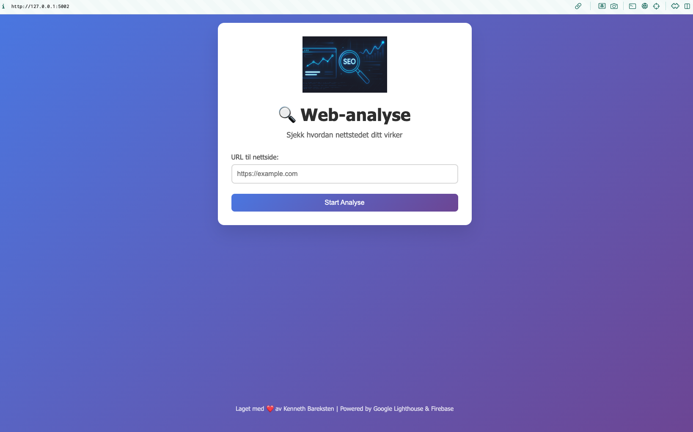
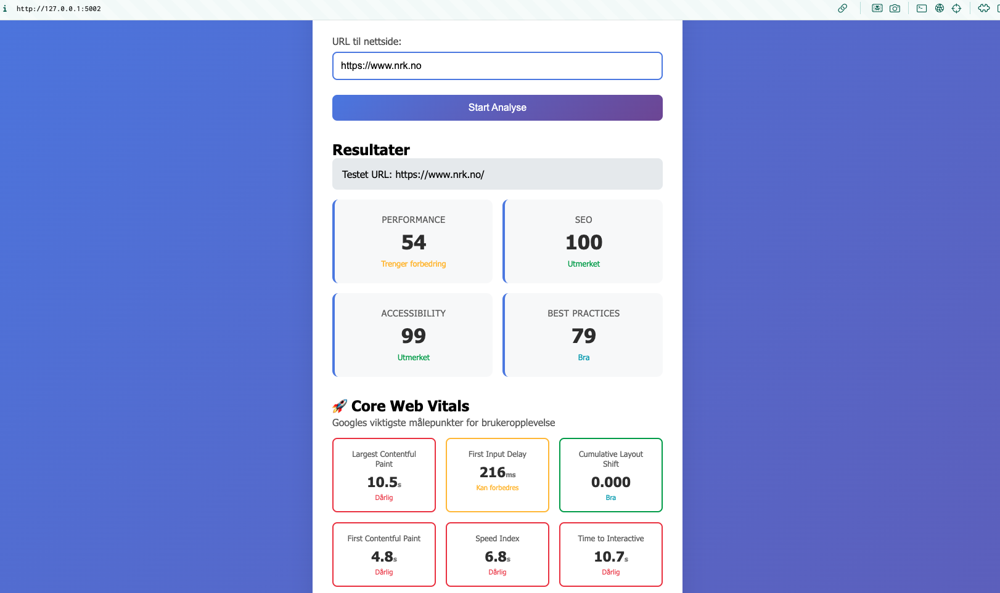
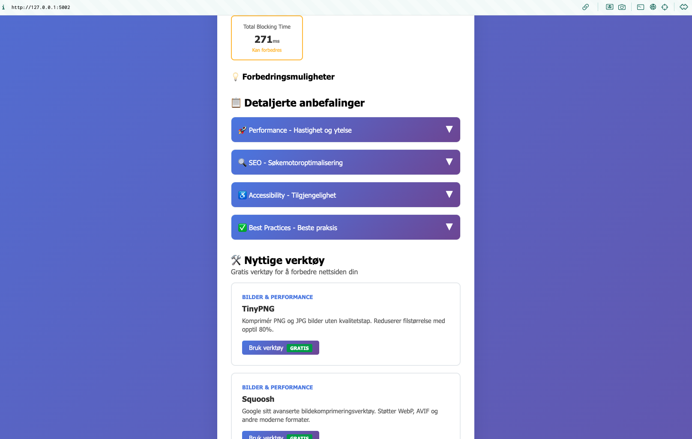
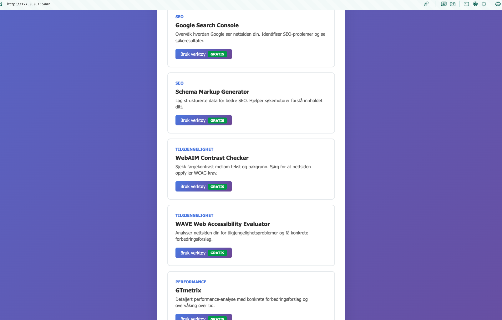

# 🔍 Web-analyse

En moderne web performance audit-applikasjon som bruker Google Lighthouse for å analysere nettsider og gi detaljerte anbefalinger for forbedringer.

## ✨ Funksjoner

- **Performance analyse** med Google Lighthouse
- **Core Web Vitals** detaljerte metrikker
- **SEO, Accessibility og Best Practices** vurdering
- **Interaktive forklaringer** av alle metrikker
- **Nyttige verktøy** for å implementere forbedringer
- **Norsk brukergrensesnitt**

## 🚀 Teknologier

- **Frontend:** HTML, CSS, JavaScript
- **Backend:** Firebase Functions (Node.js)
- **Hosting:** Firebase Hosting
- **API:** Google Lighthouse
- **Performance:** Chrome Launcher

## 📋 Installasjon

```bash
# Klon repository
git clone https://github.com/barx10/web-analyse.git
cd web-analyse

# Installer avhengigheter
npm install
cd functions && npm install

# Start lokal utvikling
firebase serve
```

## 🌐 Bruk

Denne appen kjøres lokalt på din maskin for å unngå hosting-kostnader.

```bash
# Start lokal versjon
firebase emulators:start
# Gå til http://localhost:5000
```

## 📷 Screenshots

### Hovedside


### Analyse Resultater


### Core Web Vitals Forklaring


### Nyttige Verktøy


## 📊 Hva appen analyserer

### Performance Metrikker
- **LCP** - Largest Contentful Paint
- **FID** - First Input Delay  
- **CLS** - Cumulative Layout Shift
- **FCP** - First Contentful Paint
- **SI** - Speed Index
- **TTI** - Time to Interactive
- **TBT** - Total Blocking Time

### Andre Analyser
- SEO optimalisering
- Tilgjengelighet (WCAG)
- Moderne web standarder
- Sikkerhet og beste praksis

## 🛠️ Gratis verktøy inkludert

Appen anbefaler og lenker til 12+ gratis verktøy for å implementere forbedringene:

- **TinyPNG** - Bildekomprimering
- **Google Search Console** - SEO overvåking
- **WebAIM Contrast Checker** - Tilgjengelighet
- **GTmetrix** - Performance testing
- Og flere...

## 🔧 Lokal utvikling

```bash
# Start Firebase emulators (inkluderer Functions og Hosting)
firebase emulators:start

# Åpne http://localhost:5000 i nettleseren
# Functions kjører på http://localhost:5001
```

**Merk:** Appen krever Firebase Functions som kjører lokalt for full funksjonalitet.

## 📝 Lisens

MIT License - Kenneth Bareksten

## 🤝 Bidrag

Pull requests er velkomne! For større endringer, åpne en issue først.

---
Laget med ❤️ av Kenneth Bareksten | Powered by Google Lighthouse & Firebase
